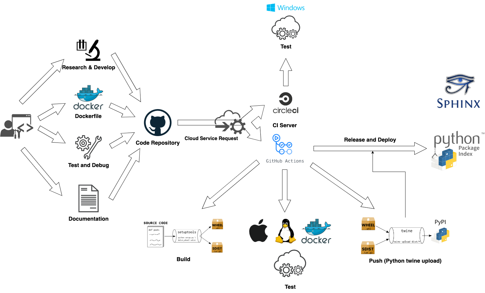
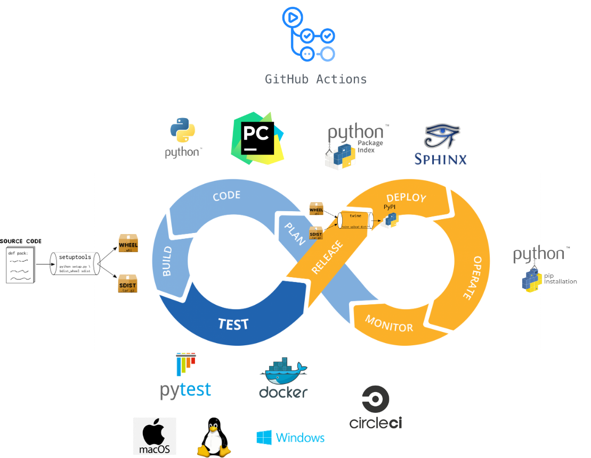
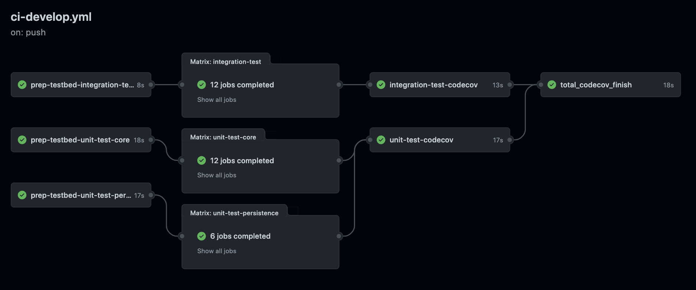
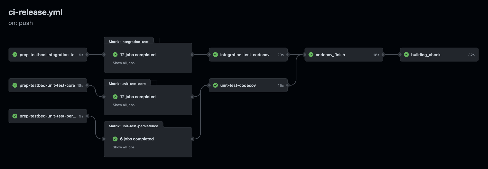
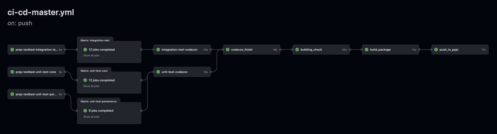

=========
CI / CD
=========

It's no time to waste too much time to do something MANUALLY after develop. In particular,
something is necessary to do every times like run tests.

Below are somethings be necessary to do and they could be automation with some CI tools:

* Prepare the runtime environment for testing
* Run tests
* Collect the code coverage which be tested
* Combine the code coverage results
* Report code coverage result
* Check and record the code quality
* Build codes
* Release codes

Absolutely, it does different things with different branch. For example, branch *develop*
focus on test and code coverage, branch *master* is responsible for run all entire flows includes
run tests, report code coverage and release code, etc.

.. _CI CD Building Status:

CI/CD Building Status
======================

+------------------+-----------------------------------+----------------------+
|        OS        |           Building Status         |    Coverage Status   |
+==================+===================================+======================+
|       Linux      |     |travis-ci build-status|      |    (Deprecated CI)   |
+------------------+-----------------------------------+----------------------+
|    Linux/MacOS   |   |github-actions build-status|   |  |codecov-coverage|  |
+------------------+-----------------------------------+----------------------+
|      Windows     |      |circle-ci build-status|     | |coveralls-coverage| |
+------------------+-----------------------------------+----------------------+
|      Windows     |      |appveyor build-status|      |    (Deprecated CI)   |
+------------------+-----------------------------------+----------------------+

CI/CD Flow
============

Work Flow
-----------

|ci-cd-work-flow|

Work Circle
-------------

|ci-cd-work-circle|

Tool
=====

*MultiRunnable* be developed with using multiple different CI tools before. Currently,
it only uses 2 CI tools: GitHub Actions & Circle-CI.

GitHub Actions
----------------

+------------------+-----------------------------------+----------------------+
|        OS        |           Building Status         |    Coverage Status   |
+==================+===================================+======================+
|    Linux/MacOS   |   |github-actions build-status|   |  |codecov-coverage|  |
+------------------+-----------------------------------+----------------------+

* Runtime OS:

    * Linux
    * MacOS

* Procedures (By branches):

    * *master*: Prepare test items -> run tests and save code coverages -> combine code coverage and submit to coverage service -> run pre-build tests -> build code -> release code
        |ci-cd-by-master|

    * *release*: Prepare test items -> run tests and save code coverages -> combine code coverage and submit to coverage service -> run pre-build tests
        |ci-by-release|

    * *develop*: Prepare test items -> run tests and save code coverages -> combine code coverage and report it
        |ci-by-develop|

* Using  Motivation:

    1. It's highly integrated with code repository platform --- GitHub.
    2. Setting of configuration is clean and easy (it's great of readable).
    3. It has rich plugins (actions) which could operate with other services, etc.
    4. The workflow feature of CI/CD is powerful.
    5. GitHub provides a UI page (Actions) to let develop clearly monitor anything about GitHub Actions (includes entire workflow).
    6. It's FREE and it provides many credits per month.

Circle-CI
-----------

+------------------+-----------------------------------+----------------------+
|        OS        |           Building Status         |    Coverage Status   |
+==================+===================================+======================+
|      Windows     |      |circle-ci build-status|     | |coveralls-coverage| |
+------------------+-----------------------------------+----------------------+

* Runtime OS:

    * Windows

* Procedures (For every branches):

    * Prepare test items -> run tests and save code coverages -> submit to coverage service

* Using  Motivation:

    1. It's workflow feature of CI/CD is powerful.
    2. It provides a website to let develop clearly monitor anything (includes entire workflow).
    3. It's FREE and it provides many credits per month.

AppVeyor (Deprecated)
-----------------------

+------------------+-----------------------------------+----------------------+
|        OS        |           Building Status         |    Coverage Status   |
+==================+===================================+======================+
|      Windows     |      |appveyor build-status|      |    (Deprecated CI)   |
+------------------+-----------------------------------+----------------------+

* Runtime OS:

    * Windows

* Procedures (For every branches):

    * Prepare test items -> run tests and save code coverages -> submit to coverage service

* Deprecated  Motivation:

    1. It's not good at workflow I need of DevOps.
    2. Setting of configuration isn't clean.

Travis-CI (Deprecated)
------------------------

+------------------+-----------------------------------+----------------------+
|        OS        |           Building Status         |    Coverage Status   |
+==================+===================================+======================+
|       Linux      |     |travis-ci build-status|      |    (Deprecated CI)   |
+------------------+-----------------------------------+----------------------+

* Runtime OS:

    * Linux

* Procedures (For every branches):

    * Prepare test items -> run tests and save code coverages -> submit to coverage service

* Deprecated  Motivation:

    1. It's not FREE.

.. |python-versions| image:: https://img.shields.io/pypi/pyversions/multirunnable.svg?logo=python&logoColor=FBE072
    :alt: travis-ci build status
    :target: https://pypi.org/project/multirunnable

.. |release-version| image:: https://img.shields.io/github/release/Chisanan232/multirunnable.svg?label=Release&amp;logo=github
    :alt: travis-ci build status
    :target: https://github.com/Chisanan232/multirunnable/releases

.. |pypi-version| image:: https://img.shields.io/pypi/v/MultiRunnable?color=%23099cec&amp;label=PyPI&amp;logo=pypi&amp;logoColor=white
    :alt: travis-ci build status
    :target: https://pypi.org/project/MultiRunnable/

.. |license| image:: https://img.shields.io/badge/License-Apache%202.0-blue.svg
    :alt: travis-ci build status
    :target: https://opensource.org/licenses/Apache-2.0

.. |travis-ci build-status| image:: https://app.travis-ci.com/Chisanan232/multirunnable.svg?branch=master
    :alt: travis-ci build status
    :target: https://app.travis-ci.com/Chisanan232/multirunnable

.. |circle-ci build-status| image:: https://circleci.com/gh/Chisanan232/multirunnable.svg?style=svg
    :alt: circle-ci build status
    :target: https://app.circleci.com/pipelines/github/Chisanan232/multirunnable

.. |github-actions build-status| image:: https://github.com/Chisanan232/multirunnable/actions/workflows/ci-cd-master.yml/badge.svg
    :alt: github-actions build status
    :target: https://github.com/Chisanan232/multirunnable/actions/workflows/ci-cd-master.yml

.. |appveyor build-status| image:: https://ci.appveyor.com/api/projects/status/v0nq38jtof6vcm23?svg=true
    :alt: github-actions build status
    :target: https://ci.appveyor.com/project/Chisanan232/multirunnable

.. |codecov-coverage| image:: https://codecov.io/gh/Chisanan232/multirunnable/branch/master/graph/badge.svg?token=E2AGK1ZIDH
    :alt: Test coverage with 'codecov'
    :target: https://codecov.io/gh/Chisanan232/multirunnable

.. |coveralls-coverage| image:: https://coveralls.io/repos/github/Chisanan232/multirunnable/badge.svg?branch=master
    :alt: Test coverage with 'coveralls'
    :target: https://coveralls.io/github/Chisanan232/multirunnable?branch=master

