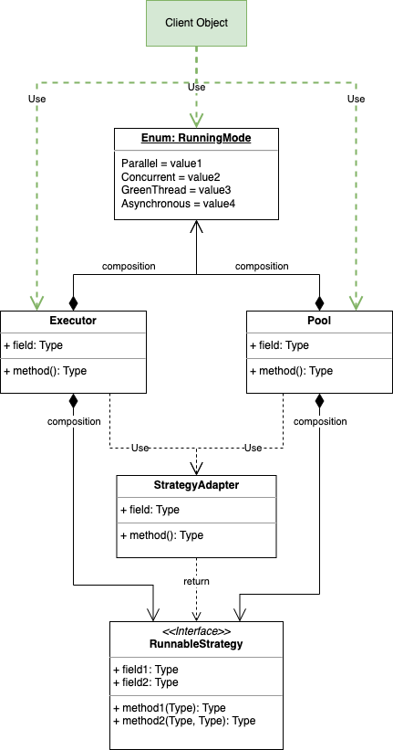
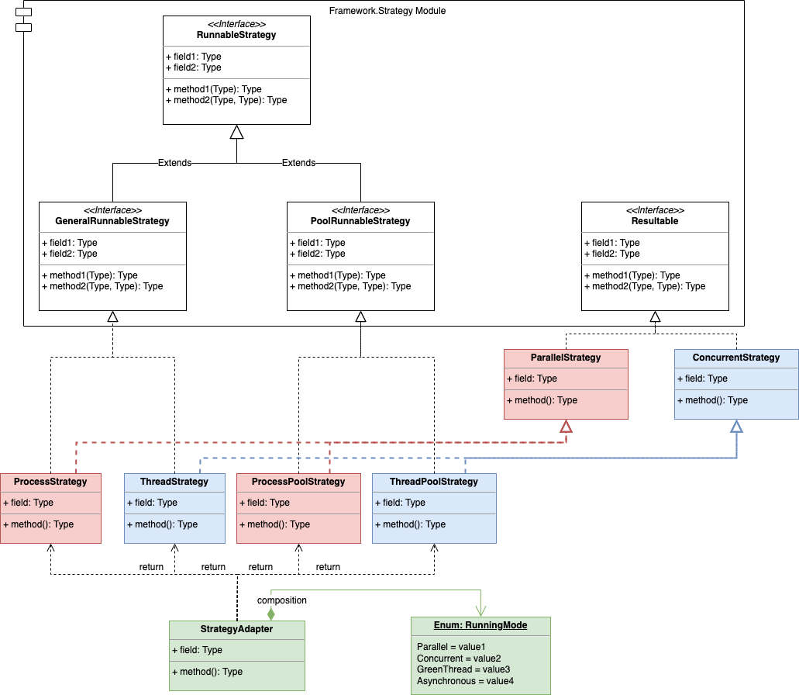
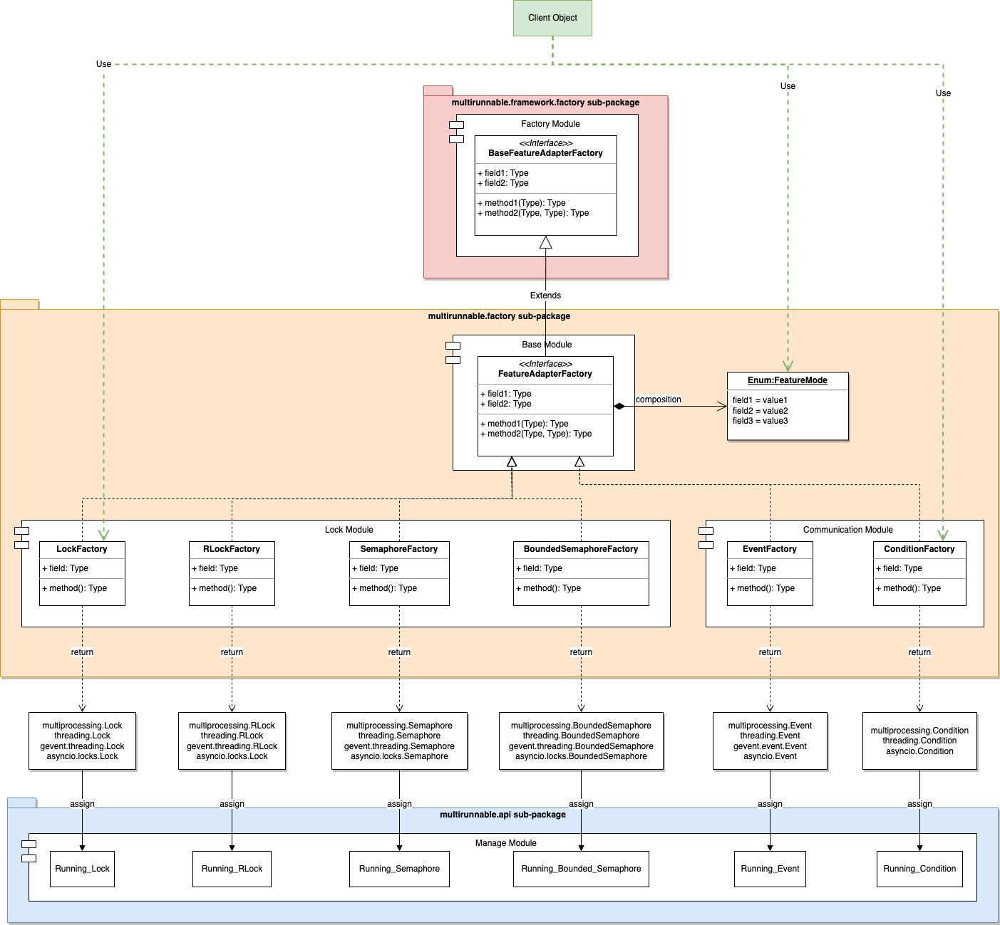
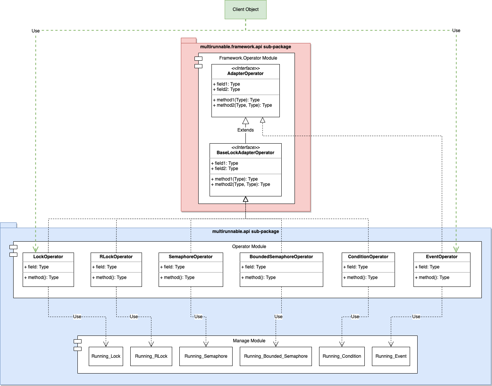
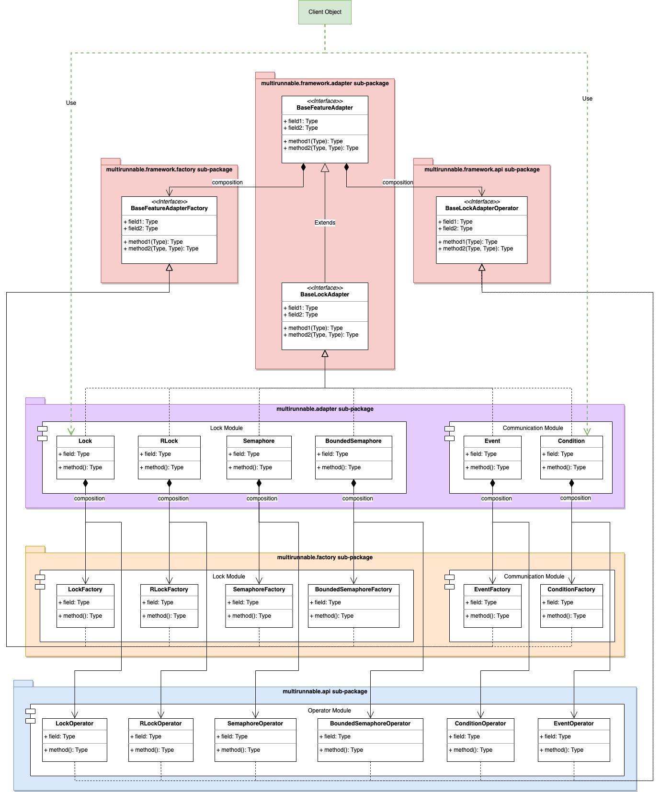
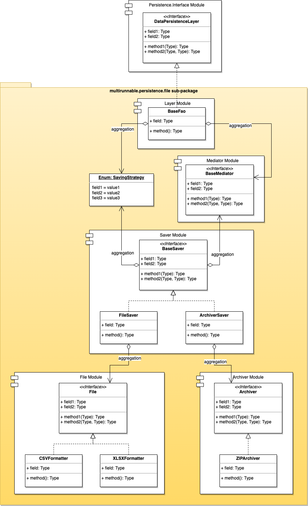
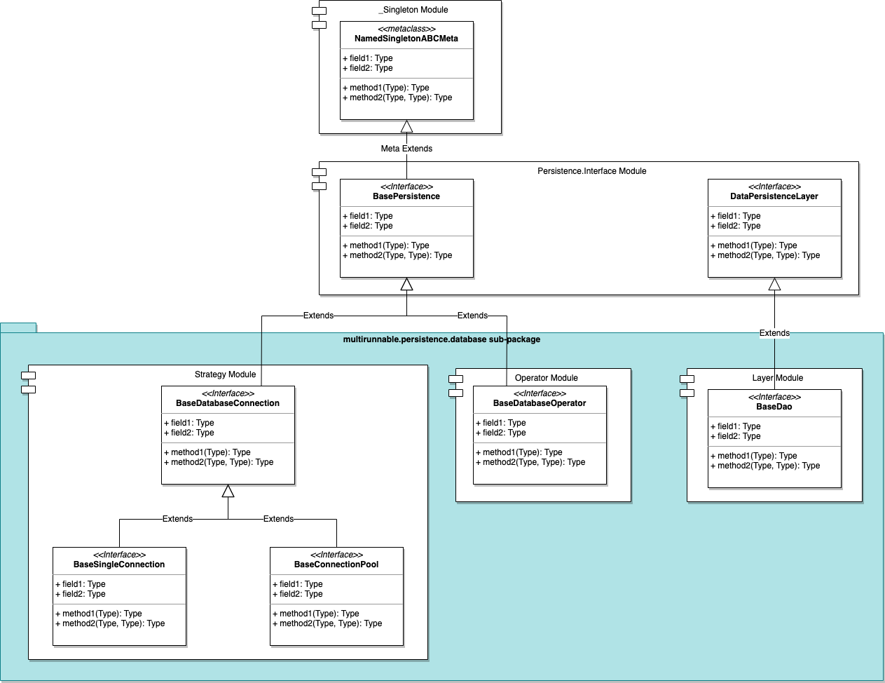

=======================
Software Architectures
=======================

*MultiRunnable* target to help developers builds parallelism humanly and clearly.
Also, the arthur of *MultiRunnable* does their best to develop and design package
so that it could let developers extends every customized features they need.

Here is the records about software architectures of every components of *MultiRunnable*.
There are 4 components:

* Entire Architecture
    UML about software relations with Executor, Pool and running strategies by client site object uses.

* Running Strategy
    UML about software relations with running strategies and how it work to return target instance by adapter **StrategyAdapter**.

* Synchronization
    UML about software relations of synchronous features.

    * Adapter Modules

    Focus on generating instance of synchronization features.

    * API Modules

    Display the UML how it work with *AdapterOperator* object.

* Persistence
    UML about software relations about persistence of *MultiRunnable*.

    * File

    UML about software relations of all modules in subpackage *multirunnable.persistence.file*.

    * Database

    UML about software relations of all modules in subpackage *multirunnable.persistence.database*.

Note:
In some architectures schematic diagrams, it has an object with green color background which is the client site
uses the features of the component.

Entire Architecture
====================

Below are all the modules which be related with others in this section:

*modules*
    * multirunnable.mode
    * multirunnable.executor
    * multirunnable.pool
    * multirunnable.factory.strategy
    * multirunnable.framework.runnable.strategy

From the  example of :doc:`home page <../index>` or demonstration in section :ref:`Executor Usage<Build by Executor>` in :doc:`../quickly_start` (or :ref:`Pool Usage<Build via Pool>`) like below:

Executor:

.. code-block:: python

    from multirunnable import SimpleExecutor, RunningMode

    executor = SimpleExecutor(mode=RunningMode.Parallel, executors=3)
    executor.run(function=<Your target function>, args=<The arguments of target function>)

Pool:

.. code-block:: python

    from multirunnable import SimplePool, RunningMode

    pool = SimplePool(mode=RunningMode.Parallel, pool_size=3, tasks_size=10)
    pool.async_apply(function=<Your target function>, args=<The arguments of target function>)

It works as Parallel with *RunningMode.Parallel*. It would turn to work as Concurrent with *RunningMode.Concurrent*.
What does it do in the Back-End? Here's a UML about relations with Executor, Pool and running strategy.

UML:

|general-usage|

Client object like the Executor or Pool example code above, its running procedure is:

1. Initial running strategy object to get the instance with *RunningMode* from *StrategyAdapter*.
2. *StrategyAdapter* returns a running strategy instance back to Executor or Pool to use.
3. Executor or Pool truly runs the target function as parallelism.

It has more details about running procedure in sections :ref:`Executor Work Flow<Executor Work Flow>` or :ref:`Pool Work Flow<Pool Work Flow>` in :doc:`flow`.

Running Strategy
==================

Below are all the modules which be related with others in this section:

*modules*
    * multirunnable.mode
    * multirunnable.factory.strategy
    * multirunnable.framework.runnable.strategy
    * multirunnable.parallel.strategy
    * multirunnable.concurrent.strategy
    * multirunnable.coroutine.strategy

Running strategy modules must be the important sections in *MultiRunnable*.
It manages and controls how it works and what it does with the *RunningMode*.

In running strategy, it has 2 different template classes: *GeneralRunnableStrategy* and *PoolRunnableStrategy*.
*GeneralRunnableStrategy* for a single runnable object and *PoolRunnableStrategy* for the pool of runnable objects.
Hence *AsynchronousStrategy* only implement the former but doesn't implement the latter.
Others strategies, *Process*, *Thread* or *Green Thread*, they all implement both of these template classes.

No matter which strategy be uses, it could return result data by method *get_result()*.
*MultiRunnable* also has a abstract class *Resultable* to define the attributes about returning result value.
Absolutely, all strategies implement it, too.

Finally, *MultiRunnable* controls which running strategy it should use with *RunningMode* by *StrategyAdapter*.

UML:

|running-strategy|

Running Procedure:

1. *StrategyAdapter* receive *RunningMode* value of option.
2. Parse the value of Enum object *RunningMode* and initial running strategy object.
3. Instantiate target running strategy instance and return it.

.. _Synchronization Software Architecture:

Synchronization
=================

The synchronization features of *MultiRunnable* be classified to 3 parts:
*multirunnable.factory*, *multirunnable.api* and *multirunnable.adapter*.
The first one responses of generating instance and the second one provides operators of the instance.
And the third one combines the features of *multirunnable.factory* and *multirunnable.api* in it.

Please refer to :doc:`Synchronization API<../api_references/synchronizations>` to get more details if it needs.

Synchronization - Factory
----------------------------

Below are all the modules which be related with others in this section:

*modules*
    * multirunnable.factory.base
    * multirunnable.factory.lock
    * multirunnable.factory.communication
    * multirunnable.api.manage
    * multirunnable.framework.factory.base
    * multirunnable.parallel.synchronization
    * multirunnable.concurrent.synchronization
    * multirunnable.coroutine.synchronization

Subpackage *Factory* generates instance only. It would generate instance with *RunningMode*
and also could set it as a global variable (save in module *multirunnable.api.manage*) to let
every runnable object uses.

It was named *Adapter* before, it be renamed as *Factory* in version 0.17.0.

UML:

|synchronization-factory|

Running Procedure:

1. Set the *FeatureMode* to property *feature_mode* of objects in *multirunnable.factory.lock* or *multirunnable.factory.communication*.
2. Parse the value of Enum object *FeatureMode* and initial feature object.
3. Instantiate target feature instance and assign it to global variable.

Synchronization - API
--------------------------

Below are all the modules which be related with others in this section:

*modules*
    * multirunnable.api.operator
    * multirunnable.api.manage
    * multirunnable.framework.api.operator

Subpackage *API* provides all operators with the instance of synchronization feature.
It would get the instance from the global variable (in module *multirunnable.api.manage*)
which be assigned by *Adapter* modules to operate.

UML:

|synchronization-api|

Running Procedure:

1. Get the target synchronization feature instance from the manage module.
2. Operate via the instance.

**Note**:
    About the entire working flow, please refer to :ref:`Synchronization Work Flow<Synchronization Work Flow>`.

Synchronization - Adapter
--------------------------

Below are all the modules which be related with others in this section:

*modules*
    * multirunnable.adapter.lock
    * multirunnable.adapter.communication
    * multirunnable.factory.base
    * multirunnable.factory.lock
    * multirunnable.factory.communication
    * multirunnable.api.operator
    * multirunnable.framework.adapter.lock
    * multirunnable.framework.factory.base
    * multirunnable.framework.api.operator

It combines features *Factory* and *API* in the subpackage *Adapter*. Therefore, it could
generate mapping instance and provide all operators with the instance of synchronization feature.
In generally, it's a great idea to choice to use *Adapter* instead of *Factory* or *API* because
it could let you focus on one object when you're using synchronization feature.

Subpackage *Adapter* is new in version 0.17.0.

UML:

|synchronization-adapter|

Running Procedure:

1. Set the *FeatureMode* to property *feature_mode* of objects in *multirunnable.adapter.lock* or *multirunnable.adapter.communication*.
2. Parse the value of Enum object *FeatureMode* and initial feature object.
3. Instantiate target feature instance and assign it to global variable.
4. Get the target synchronization feature instance from the manage module.
5. Operate via the instance.

Persistence - File
===================

Below are all the modules which be related with others in this section:

*modules*
    * multirunnable.persistence.interface
    * multirunnable.persistence.file.files
    * multirunnable.persistence.file.archivers
    * multirunnable.persistence.file.saver
    * multirunnable.persistence.file.mediator
    * multirunnable.persistence.file.layer

Subpackage *.persistence.file* provides some different file formatters to save,
and it also has some saving strategies to save in different ways for parallelism.
It has some modules in this subpackage:

* Files
    It defines all attributes and methods a file formatter object should have .
    The file formatter object also be provided to *Saver* object to use.

* Archivers
    It's same as *Files* but for archiver format.

* Savers
    Define the saving or compressing process with the *Files* or *Archivers*.

* Mediators
    The decision about who could do what thing.

* Persistence Layer
    The facade that provides APIs which has encapsulated some methods using above modules to developers to use.

For example, *Files* and *Archivers*: what it can do. *Savers*: how it work with them.
*Mediators*: how it can work. *Persistence Layer*: all in it to use.

UML:

|persistence-file|

Running Procedure:

1. Receive mediator and saving strategy.
2. Initial mediator.
3. Saving process.

It would run in different way with different saving strategy in the saving process.
About working flows, please refer to :ref:`Persistence as file Work Flow<Persistence - File Work Flow>` to get more info.
About details, please refer to :doc:`Persistence as File API<../api_references/persistence_file>`.

Persistence - Database
=======================

Below are all the modules which be related with others in this section:

*modules*
    * multirunnable.persistence.interface
    * multirunnable.persistence.database.strategy
    * multirunnable.persistence.database.operator
    * multirunnable.persistence.database.layer

Concept of subpackage *.persistence.database* like as *.persistence.file*.
It could initial connection instance with 2 strategies and classifies to 3 sections:

* Connection Factory
    It responses of generating database connection instance.

* Database Operators
    Implementation of database operators.

* Persistence Layer
    The facade that provides some APIs to let subclass to use.

In short, *Connection Factory*: how the instance be initial to get and connect to instantiate.
*Database Operators*: what operators it has. *Persistence Layer*: the template which has database operators for subclass.

UML:

|persistence-database|

Running Procedure:

1. Instantiate the subclass of *DatabaseConnection* (it has 2 strategy: *BaseSingleConnection* and *BaseConnectionPool*).
2. Instantiate the subclass of *DatabaseOperator* with argument which value is the instance of subclass of *DatabaseConnection*.
3. Extend *BaseDao* and implement the method *database_opt* which would return the instance of subclass of *DatabaseOperator*.
4. Do some operators by the instance of the subclass of *BaseDao*.

About persistence with database working flows, please refer to :ref:`Persistence with database Work Flow<Persistence - Database Work Flow>` to get more info.
About details, please refer to :doc:`Persistence with Database API<../api_references/persistence_database>`.

