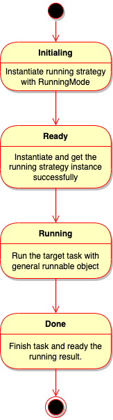
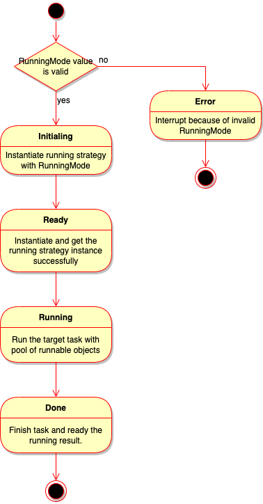
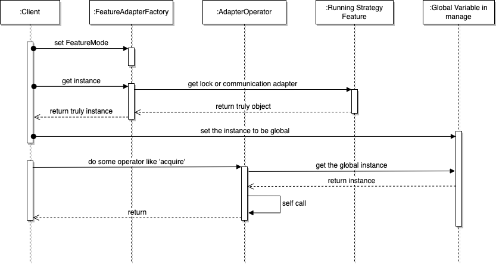
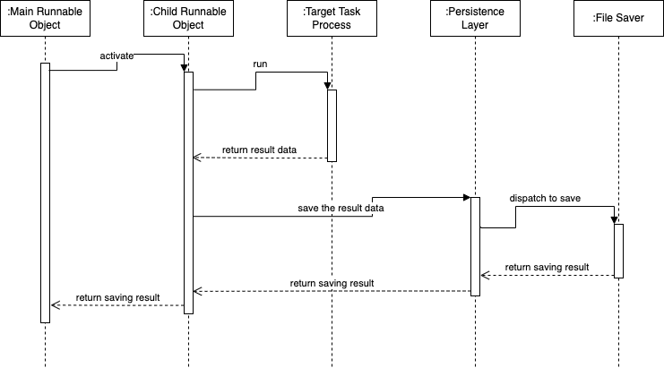
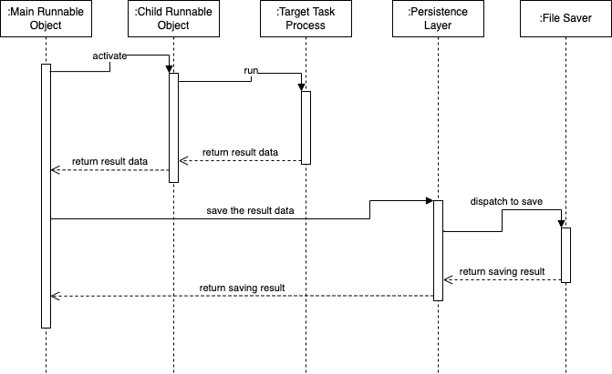
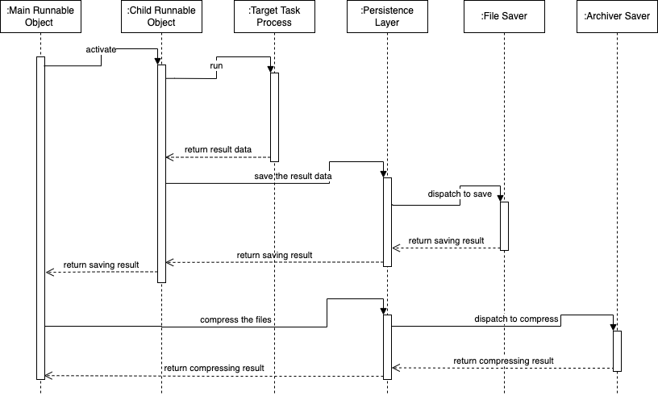
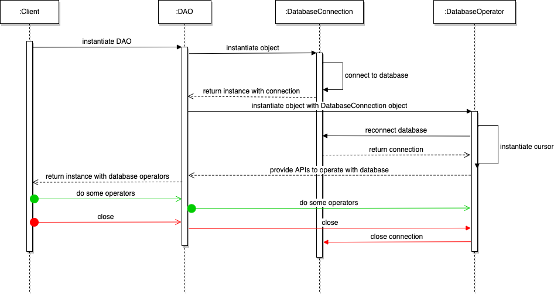
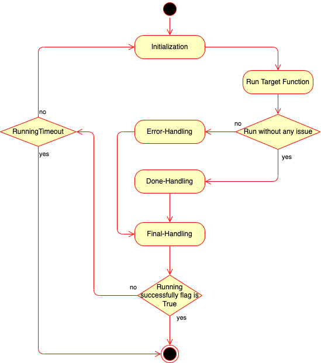

=======
Flows
=======

Here are some flows of components of *MultiRunnable* to describe the working details
like how it work and what it happen.

Basically, it has 5 sections:

* Work Flow
   * Runnable Object -  Executor
        A executor be initialed to the end.

   * Runnable Object -  Pool
        A pool of executors be initialed to the end.

   * Synchronization
        Demonstrate how a synchronization feature works with modules *Adapter* and *API*.

.. Here is the comment of document. Consider about the necessary of section.
    * Runnable Object - Data Flow
        This section focus on the result data of *Executor* or *Pool*.

        * Executor
        * Pool

* Persistence
    There are different strategies for *File* or *Database* of *MultiRunnable*.
    Each of their work flows are slightly different.

    * File
        About saving as file, it has 3 saving strategies currently:

        * One Thread One File
        * All Threads One File
        * One Thread One File and Compress All

    * Database
        Connection strategy of *Database* section

        * One Single Connection
        * Connection Pool

* Retry Mechanism
    Working flow about retry processing.

Work Flow
===========

.. _Executor Work Flow:

Executor
---------

*Executor* like a bridge in *MultiRunnable*, developers doesn't need to care about which running strategy object them uses,
they just set the argument *mode* first and use the APIs it provides.

Therefore, the running procedure of *Executor* as below:

1. It would initial running strategy object first with the value of option *mode*.
2. Instantiate and ready the running strategy instance to use.
3. Let outside to use the APIs.
4. Run and done the target tasks. (including initial runnable object, activate them, etc)

Here's the activity diagram of *Executor*:

|executor-activity-diagram|

.. _Pool Work Flow:

Pool
-----

For *Pool*, it's mostly same as *Executor*. The different is:

* It would check the value of option *mode* because it doesn't support running mode *Asynchronous*.

Here's the activity diagram of *Pool*:

|pool-activity-diagram|

.. _Synchronization Work Flow:

Synchronization
-----------------

The synchronization features of *MultiRunnable* has 2 sections:
generating instance (*Adapter* modules) and operators of instance (*API* modules).
*Adapter* modules responses of generating feature instance and
*API* modules provides the operators of instance which be initial by *Adapter* modules.

Therefore, the running procedure of *Executor* as below:

* *Adapter*: Generating instance
    1. Set the *FeatureMode* by property *feature_mode*.
    2. Instantiate and ready the feature instance by method *get_instance*.
    3. Assign the instance to the mapping global variable by method *globalize_instance*.

* *API*: Provides the APIs (operators) of the instance
    1. Get the instance by protected method *_get_feature_instance*.
    2. Provides the APIs to outside.

Here's the sequence diagram of *Synchronization*:

|synchronization-sequence-diagram|

The synchronization feature classes is the subclass of *FeatureAdapterFactory* like *Lock*, *Semaphore*, etc.
About *Running Strategy Feature*, it's different feature module with different *FeatureMode*.
For example, it's *multirunnable.parallel.feature* module if *FeatureMode* is *Parallel*.
The global variable is the mapping of each synchronization feature classes.

About details of APIs, please refer to :doc:`Synchronization API<../api_references/synchronizations>`.
About software architecture of synchronization features, please refer to :ref:`Software Architecture of Synchronization<Synchronization Software Architecture>`.

.. Here is the comment of document. Consider about the necessary of section.
    Data Flow
    ===========

    Content ...

Persistence
=============

It has 2 way about persistence of *MultiRunnable*: as file or into database.

.. _Persistence - File Work Flow:

Persistence - File
-------------------

It has 3 strategies to save data if it chooses to persistence as file format.
In currently version of *MultiRunnable*, it has 3 strategies:

* **One Thread One File**

Every runnable object would save data as file.

Procedure is:

1. Main runnable object would initial and activate multiple child runnable objects.
2. Child runnable objects run target task.
3. In the target task, it would save data which be needed as file via persistence layer (*FAO*).

Sequence Diagram with *One Thread One File* of *File*:

|persistence-file-otof-sequence-diagram|

* **All Threads One File**

Every runnable objects would return the result data back to main runnable object,
and main runnable object would save all the result data as target file format.

Procedure is:

1. Main runnable object would initial and activate multiple child runnable objects.
2. Child runnable objects run target task.
3. In the target task, it would return the result data back to outside (main runnable object).
4. Finally, it would save data which be needed as file via persistence layer (*FAO*) in main runnable object.

Sequence Diagram with *All Threads One File* of *File*:

|persistence-file-atof-sequence-diagram|

* **One Thread One File and Compress All**

Every runnable object would save data as target file format, it does the same thing as strategy *One Thread One File*.
But main runnable object would compress all the files finally with this strategy.

Procedure is:

1. Main runnable object would initial and activate multiple child runnable objects.
2. Child runnable objects run target task.
3. In the target task, it would return a NamedTuple object which format is: key is file name (file path) and value is data streaming object.
4. Main runnable object would save the data as target file format and compress all of them.

Sequence Diagram with *One Thread One File and Compress All* of *File*:

|persistence-file-otofca-sequence-diagram|

.. _Persistence - Database Work Flow:

Persistence - Database
-----------------------

Persistence with database is the same as synchronous features modules,
it has 2 sections are generating connection instance and operators with the database.
For generating connection instance, it has 2 ways to implement: *BaseSingleConnection* or *BaseConnectionPool*.
And its working flows are slightly difference with different ways.

Running Procedure:

* **Single one connection**:

1. Connect and instantiate the database connection instance.
2. Initial database cursor instance via connection instance.
3. Do some operators by cursor instance.
4. Close the cursor instance.
5. Close the connection instance.

* **Connection Pool**:

1. Check the key (class name) whether it exists in a global dictionary type value or not.
2. It's a Singleton class, so it would check the whether instance exists or not before it instantiates it:

    2-1. It returns the value (connection pool instance) of the key directly.

    2-2. If it doesn't have the key, it connect to database and initial a connection pool object. And it would save the pool instance into the global variable with pool name as key before it returns the pool instance.

3. Get one connection instance from the pool.
4. Initial database cursor instance via connection instance.
5. Do some operators by cursor instance.
6. Close the cursor instance.
7. Connection be release back to the pool instance.

Sequence diagram of *Persistence-Database*:

|persistence-database-sequence-diagram|

.. _Retry Mechanism:

Retry Mechanism
=================

*MultiRunnable* has its own retry mechanism *multirunnable.api.decorator.retry*.
It could do some processes of a target function.

Procedure is:

1. Run the initialization process (it doesn't return anything).
2. Run the target function.
3. It has a try-catch on target function:

    3-1. If it occurs exception, it would run the error-handling with the exception.

    3-2. If it run finely without any issue, it would run the done-handling with the result data and set a running successfully flag.

4. No matter whether it occurs exception or not, it musts to run the final-handling finally.
5.Check the running successfully flag:

    5-1. If it's True, the task has done and return result data.

    5-1. If it's False, it would rerun the task function. It would occur timeout if it exceeds the retry times.

Here's the activity diagram of *Retry Mechanism*:

|retry-activity-diagram|

